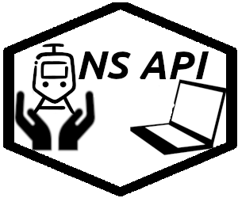

<!-- README.md is generated from README.Rmd. Please edit that file -->

```{r setup, include = FALSE}
knitr::opts_chunk$set(
  collapse = TRUE,
  comment = "#>",
  fig.path = "man/figures/README-",
  out.width = "100%"
)
```

# nsapi
[](https://cran.r-project.org/package=nsapi)
[](https://choosealicense.com/licenses/mit/)
[](http://www.repostatus.org/#active)
[](THANKS.md)
[](https://www.tidyverse.org/lifecycle/#maturing)

The Dutch National Railway service (NS; Nederlandse Spoorwegen) has an API where we can
query for travel advise, see the current trains on a given station, see if there is any delays or work on the tracks and NS also provides a list with geolocation of all the stations. 

The goal of nsapi is to make it easy to gather data from the NS API. The package returns data frames for every response.



## Installation

You can NOT YET install the released version of nsapi from [CRAN](https://CRAN.R-project.org) with:

``` r
install.packages("nsapi")
```
But you can install the development version from [GitHub](https://github.com/) with:

``` r
# install.packages("devtools")
devtools::install_github("RMHogervorst/nsapi")
```
## Example

This is a basic example which shows you how you get travel information:

```{r}
library(nsapi)
```


```{r example}
treinplanner <- get_travel_advise(
  fromStation = "Leiden Centraal", 
  toStation = "Utrecht Centraal",
  departure = TRUE,
  yearCard = TRUE,
  previousAdvises = 1, 
  nextAdvises = 1)
treinplanner
```

# FAQ

1. What Can I do with the package?

- You can access the departures from a station, disruptions (planned and unplanned), get travel advise (between stations) and a list of all stations (in the Netherlands and some outside.). In the [vignette](articles/basic_use_nsapi_package.html) I've described how to use the functions. 

2. I'm getting a curl timeout!

- Yes... That happens, a lot. The NS website does not return errors but just times you out once in a while. Take a deep breath, retry. 

3. Error Bad request or HTTP 400 

- Your username and password might not be set properly

4. How do I set a password and username?

- See Authentication in the vignette


## Metadata
The package is MIT licensed although the information from NS is probably proprietary

```{r}
codecoverage <- covr::package_coverage(path = ".",type = "tests")
print(codecoverage)
```

