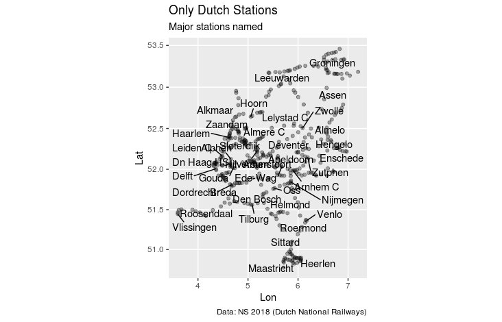

```{r setup, include = FALSE}
NOT_CRAN <- identical(tolower(Sys.getenv("NOT_CRAN")), "true")
knitr::opts_chunk$set(
  collapse = TRUE,
  comment = "#>", 
  cache = FALSE
)

#knitr::opts_chunk$set(purl = NOT_CRAN)
library(nsapi)
```


This is a description and use of all the functions in the package.

The API returns everything in Dutch and therefore I have kept the responses in Dutch as well. The NS website does have a English translation which I will link to here: 
<https://www.ns.nl/en/travel-information/ns-api>.

First a description of how to set up your username and password and than a breakdown of all the functions.

# Authentication
Before you can use any of the functions you need a username and password
To get that go to: <https://www.ns.nl/ews-aanvraagformulier/>

You will receive a confirmation email, and finally a username and password (that can't be changed for some reason).

You need to add the username and password to your rsession for the nsapi package to work.
Why? Good question! It is not smart to type your passwords in a R session, they will end up in your history file and will be available for everyone who searches your computer. 
You might think that this password and account is not that important and you might be right, but let's do the right thing anyway.

## Temporary adding acountname and password to your session
A temporary way is to add them to your session with :

```{r, eval=FALSE}
Sys.setenv(NSAPIACCOUNT = "probablyyouremail@email.com")
Sys.setenv(NSAPIPW = "yourpasswordgiveninplaintextoveremailwhydopeopledothisohgod")
```

At the end of your session (if you go to a new project, if you restart R or if you crash) the keys are removed from memory. Keep in mind that this DOES put your password in the history file and is therefore NOT recommended. 

## Permanently adding username and password to your r session

Go to your global .Renviron file (or make one) and add the keys
```{r, eval=FALSE}
file.edit("~./.Renviron")
```

The file will open and you can add two entries:

```
NSAPIPW = yourpasswordgiveninplaintextoveremailwhydopeopledothisohgod
NSAPIACCOUNT = probablyyouremail@email.com
```

How do you know if you succeeded?

```{r, eval=NOT_CRAN}
check_ns_api_keys()
```


# Getting travel advise

If you'd like to know when your train from Amsterdam to Groningen goes,
use the travel_advise function with departure and arrival station. 

```{r, eval=NOT_CRAN}
library(nsapi)
ams_to_ut <- get_travel_advise(
  fromStation = "Amsterdam Centraal",
  toStation = "Utrecht Centraal",
  #dateTime = , # I don't use it because I want to leave now!
  departure = TRUE  # I want to depart now
)
ams_to_ut[,1:5]
```

The function returns a data.frame with 4 advises before and 4 after the time you selected.

```{r, eval=NOT_CRAN}
ams_to_ut[,6:8]
```

## More details about the returned dataframe.
The column Reisdeel is a nested data frame with a nested data frame called stops within. 

```{r, eval=NOT_CRAN}
str(ams_to_ut[1,13])
```
 The API returns a lot of nested information, and as a consequence the data.frame is nested too.

Every row is thus an advise with arrival and departure times and travelparts,
if you have to switch trains there will be more than 1 row in the ReisDeel column.
For instance in the first row:

```{r, eval=NOT_CRAN}
ams_to_ut$ReisDeel[[1]]
```

And every part of the trip has stops where the train stops:

```{r, eval=NOT_CRAN}
ams_to_ut$ReisDeel[[1]]$Stops[[1]]
```

# Stationlist
Another endpoint of the API is a list of stations. 

```{r, eval=NOT_CRAN}
stations <- get_stationlist()
head(stations)
names(stations)
```

This will return a data frame with all the stations in the NS API.
There are not only Dutch stations, but also multiple Belgian, German, English, Austrian, French,Polish and other country stations. 
Every station has an international code, name, synonyms, geolocation (Lat, Lon), and type of station. 

```{r, eval=FALSE}
# code is not executed, I don't want to add these dependencies to the package
library(tidyverse)
library(ggrepel)
stations <- 
  get_stations() %>% 
  mutate(Naam = map_chr(Namen, ~.[["Kort"]][[1]]),
  Label = ifelse(Type == "knooppuntIntercitystation", Naam,NA) ) %>% 
  as.tibble() 

stations %>% 
  filter(Land == "NL") %>% 
  ggplot(aes(Lon, Lat, label = Label))+ 
  geom_point(alpha = 1/3)+
  geom_text_repel()+
  coord_map()+
  labs(
    title = "Only Dutch Stations",
    subtitle = "Major stations named",
    caption = "Data: NS 2018 (Dutch National Railways)"
  )
```




# Departures

You can see the departure times of any station at this time by calling the `departures()` function. 

```{r, eval=NOT_CRAN}
leiden_trains <- get_departures(station = "Leiden Lammenschans")
head(leiden_trains)

```


# Disruptions and maintenance

These 3 functions call out to find out about disruptions and engineering on the tracks for the current time, for the next 2 weeks or a specific station.
Every call returns a dataframe with "id", "Traject", "Periode", "Reden", "Bericht", "Advies", and "Datum". 

Bericht is often a complete message with html markup:

```
<p>\n<b>Wanneer: vanaf zaterdag 26 mei </b><br/>\n<b>Oorzaak: aangepaste dienstregeling</b><br/>\n<b>Advies: U kunt gebruikmaken van de gewijzigde dienstregeling</b>\n<br/>Stoptreinen tussen Roosendaal en Antwerpen Centraal/Puurs rijden in een aangepaste dienstregeling; reizigers dienen in Essen (B) over te stappen op een andere trein\n<br/> plan uw reis in de Internationale Reisplanner\n<br/> <br/>\n  <b>Extra reistijd: een kwartier tot een half uur</b><br/>\n</p>
```

## Current disruptions  (=unscheduled disruptions + current engineering work)

Showing only columns Traject and Periode:

```{r, eval=NOT_CRAN}
current <- get_current_disruptions()
current[1:2, c("Traject", "Periode")] # I'll show a sample of the responses
```

## Scheduled engineering work(=scheduled engineering work) 
This call returns scheduled engineering work for the next 2 weeks.

example:
```{r, eval=NOT_CRAN}
sched <- get_scheduled_engineering_work()
sched[2:4,c("Traject","Periode", "Advies")]
```

## Current disruptions for a specific station (=unscheduled disruptions + current engineering work)

Showing only first 2 messages:

```{r, eval=NOT_CRAN}
get_disruptions_station(station = "Rotterdam Centraal")$Bericht[1:2]
```
